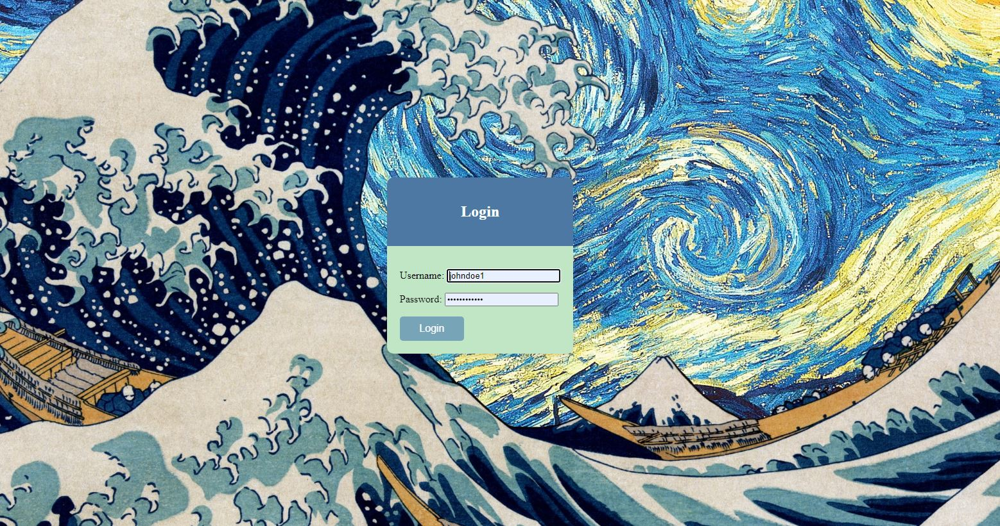
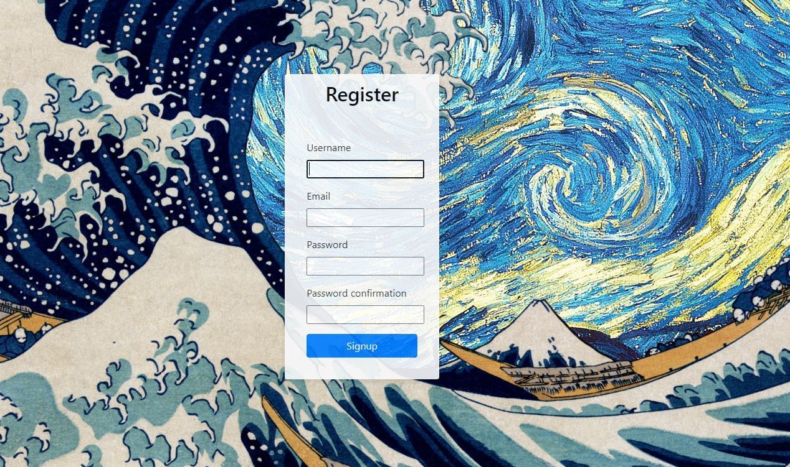
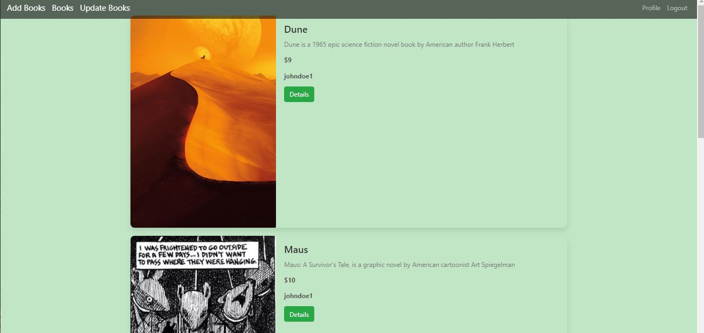

# Digital-Book-Store
A digital book store made with django 

# Django Digital Book Store Learning Journey

Welcome to my Django Digital Book Store project! This has been a practical journey where I've picked up various Django skills. Here's a rundown of what I've learned:

## Screenshots

### Landing Page

### Login Page

### Register Page

### Main Page

## Learning Outcomes

### 1. Views
I learned how to create views in Django, which are basically the functions handling what users see on different pages. Think of them as controllers in the MVC pattern.

### 2. URL Patterns
Understanding URL patterns helped me direct users to the right views. Whether it's in the app's `urls.py` or the project level, it's about guiding the traffic in your app.

### 3. Models
Models are like blueprints for your database. I got the hang of defining what kind of data my app stores and how it's structured. Migrations, in simple terms, are applying these changes to the database.

### 4. Admin Panel
The admin panel is a handy tool for managing your app's data. Creating a superuser gave me access to this panel, allowing me to add and edit data easily.

### 5. Templates
I figured out how to use HTML pages in my Django app. With templates, I could show dynamic data from the database on these pages, making my app more interactive.

### 6. Static Files
Adding some style to my site was exciting! I learned to use CSS by organizing static files in a folder. The `` tag helped integrate these files into my pages.

### 7. Authentication
Implementing user login, logout, and sign-up features was a big step in making my app secure and user-friendly. It's the basic stuff needed for user management.

### 8. Django Signals
Django signals allowed different parts of my app to talk to each other. They're like notifications – one part of the app can react when something happens elsewhere.

### 9. Class Based Views (CBVs)
CBVs provide a structured way to organize views. I found them more reusable and cleaner compared to function-based views.

## Getting Started
To dive into this learning experience:

1. Clone the repository: `git clone https://github.com/your-username/django-digital-book-store.git`
2. Install dependencies: `pip install -r requirements.txt`
3. Apply migrations: `python manage.py migrate`
4. Create a superuser: `python manage.py createsuperuser`
5. Run the development server: `python manage.py runserver`

Visit [http://localhost:8000/admin](http://localhost:8000/admin) to access the admin panel and explore the functionalities of the Django Digital Book Store project.

## Contributing
If you find issues or want to contribute, please follow the [contribution guidelines](CONTRIBUTING.md).

## License
This project is licensed under the MIT License - see the [LICENSE](LICENSE) file for details. Join me in this open-source journey!
